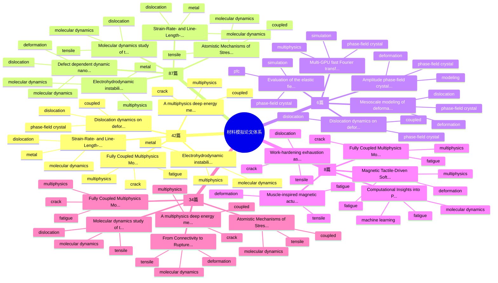
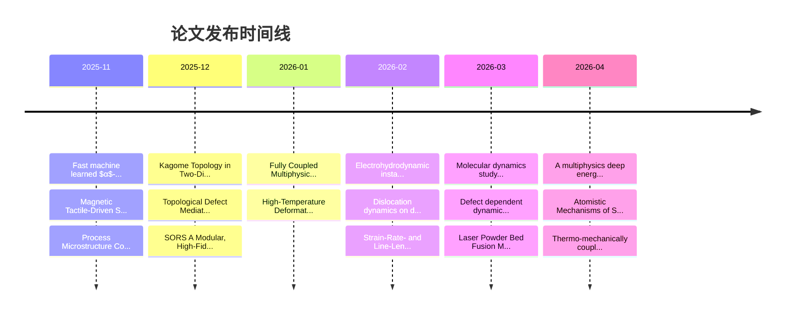

# 📚 Paper Daily Agent — 材料模拟论文自动化知识体系

自动发现、分析、总结材料模拟领域论文，构建持续更新的知识图谱。

## 研究方向

- 多物理耦合 (Multiphysics Coupling)
- 分子动力学模拟 (Molecular Dynamics)
- 相场晶体模型 (Phase-Field Crystal)
- 金属疲劳模拟 (Metal Fatigue Simulation)
- 拉伸/变形模拟 (Tensile / Deformation Simulation)

## 核心功能

1. **每日论文抓取**: 从 arXiv 获取最新论文，按关键词评分筛选 Top 5。
2. **智能摘要**: 通过 Claude (Anthropic API) 生成中文深度技术分析（研究背景、方法细节、定量结论、研究价值、可复现性）。
3. **PDF 深度解析**: 自动下载 PDF，提取方法/实验章节的边界条件、网格、时间步、势函数、载荷路径等参数。
4. **知识体系构建**: 自动维护 `knowledge_system.md`、`focus_year_summary.md` 体系化文档。
5. **可视化仪表盘**: 生成交互式 HTML 仪表盘（时间线、主题分布、关键词热度、论文关联网络）。
6. **Mermaid 知识图谱**: 在 Markdown 中嵌入思维导图和时间线，GitHub 可直接渲染。
7. **Telegram 推送**: 每日通过 Telegram Bot 发送中文阅读提醒。
8. **GitHub Actions 自动化**: 每天北京时间 9:00 自动运行并提交更新。

## 快速开始

```bash
# 初始化项目
python3 paper_agent.py init --root . --config config.json

# 手动运行一次更新
python3 paper_agent.py update --root . --config config.json --notify

# 干运行（不实际发送 Telegram）
python3 paper_agent.py update --root . --config config.json --notify --notify-dry-run
```

## 环境变量

在 GitHub Secrets 或本地 `~/.clawdbot/.env` 中配置：

| 变量名 | 说明 |
|--------|------|
| `ANTHROPIC_API_KEY` | Anthropic API Key（用于 Claude 生成论文总结） |
| `TELEGRAM_BOT_TOKEN` | Telegram Bot Token（通过 @BotFather 创建） |
| `TELEGRAM_CHAT_ID` | Telegram Chat ID（你的用户 ID 或群组 ID） |

## GitHub Actions 自动化

项目通过 `.github/workflows/daily_paper.yml` 实现每日自动运行：

1. 每天 UTC 01:00（北京时间 09:00）自动触发
2. 抓取新论文、生成摘要、更新知识体系
3. 发送 Telegram 通知
4. 自动 commit & push 更新到仓库

需要在 GitHub 仓库 Settings → Secrets and variables → Actions 中添加上述三个 Secret。

也支持手动触发：Actions → Daily Paper Update → Run workflow。

## 导入已读论文

```bash
# 准备 CSV（格式：title,authors,year,link,tags,notes）
python3 paper_agent.py ingest-known --root . --config config.json --csv ./known_papers_template.csv
```

## 项目结构

```text
.
├── .github/workflows/daily_paper.yml  # GitHub Actions 定时任务
├── config.json                         # 配置文件
├── paper_agent.py                      # 核心脚本
├── run_daily.sh                        # 本地定时运行脚本
├── data/
│   ├── notes/                          # 每篇论文的详细笔记
│   ├── paper_db.json                   # 论文数据库
│   └── pdf_cache/                      # PDF 缓存（不提交 git）
└── reports/
    ├── daily/                          # 每日报告
    ├── dashboard.html                  # 📊 交互式可视化仪表盘
    ├── knowledge_graph.md              # 🗺️ Mermaid 知识图谱
    ├── knowledge_system.md             # 📋 知识体系文档
    └── focus_year_summary.md           # 📈 年份-侧重点汇总
```

## 知识图谱（自动更新）

<!-- KNOWLEDGE_GRAPH_START -->
> 自动更新 | 总论文数: 137 | 最后更新: 2026-04-26 04:19 UTC

### 知识体系思维导图



### 论文发布时间线



### 主题-侧重点交叉分析

| 主题方向 | 论文数 | 主要侧重点 | 代表论文 |
|----------|--------|------------|----------|
| Multiphysics Coupling | 42 | 多物理耦合与跨场耦合机制, 拉伸响应与本构行为, 分子动力学与原子尺度机制 | Fully Coupled Multiphysics Model... |
| Molecular Dynamics | 87 | 分子动力学与原子尺度机制, 多物理耦合与跨场耦合机制, 数据驱动与机器学习建模 | Electrohydrodynamic instability... |
| Phase-Field Crystal | 6 | 相场晶体与组织演化, 拉伸响应与本构行为, 多物理耦合与跨场耦合机制 | Dislocation dynamics on deformab... |
| Metal Fatigue Simulation | 8 | 疲劳损伤与断裂演化, 多物理耦合与跨场耦合机制, 拉伸响应与本构行为 | Fully Coupled Multiphysics Model... |
| Tensile / Deformation Simulation | 34 | 拉伸响应与本构行为, 分子动力学与原子尺度机制, 疲劳损伤与断裂演化 | Fully Coupled Multiphysics Model... |

### 高相关度论文 Top 10

1. **[Fully Coupled Multiphysics Modelling of Fracture Behaviou...](https://arxiv.org/abs/2601.01443v1)** (score: 14.0) — Metal Fatigue Simulation, Multiphysics Coupling
2. **[Molecular dynamics study of the role of anisotropy in rad...](https://arxiv.org/abs/2603.25617v2)** (score: 13.9) — Molecular Dynamics, Tensile / Deformation Simulation
3. **[A multiphysics deep energy method for fourth-order phase-...](https://arxiv.org/abs/2604.03453v1)** (score: 13.6) — Multiphysics Coupling, Tensile / Deformation Simulation
4. **[Electrohydrodynamic instability of Cu, W and Ti metal nan...](https://arxiv.org/abs/2602.12558v1)** (score: 12.7) — Molecular Dynamics, Multiphysics Coupling
5. **[Dislocation dynamics on deformable surfaces](https://arxiv.org/abs/2602.14348v1)** (score: 12.4) — Multiphysics Coupling, Phase-Field Crystal
6. **[Defect dependent dynamic nanoindentation hardness of copp...](https://arxiv.org/abs/2603.01845v1)** (score: 12.2) — Molecular Dynamics
7. **[Strain-Rate- and Line-Length-Dependent Screw Dislocation...](https://arxiv.org/abs/2602.16883v1)** (score: 11.4) — Molecular Dynamics, Multiphysics Coupling
8. **[Atomistic Mechanisms of Stress-Dependent Molten Salt Corr...](https://arxiv.org/abs/2604.16261v1)** (score: 10.9) — Molecular Dynamics, Multiphysics Coupling
9. **[From Connectivity to Rupture: A Coarse-Grained Stochastic...](https://arxiv.org/abs/2602.08089v1)** (score: 10.7) — Molecular Dynamics, Tensile / Deformation Simulation
10. **[Laser Powder Bed Fusion Melt Pool Dynamics for Different...](https://arxiv.org/abs/2604.07359v1)** (score: 10.6) — Multiphysics Coupling
<!-- KNOWLEDGE_GRAPH_END -->

## 可视化

- **`reports/dashboard.html`** — 本地打开即可查看交互式图表（时间线、主题饼图、关键词热度、论文网络图）
- **`reports/knowledge_graph.md`** — 在 GitHub 上直接渲染 Mermaid 思维导图和时间线
