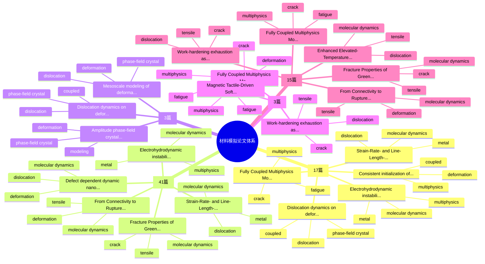
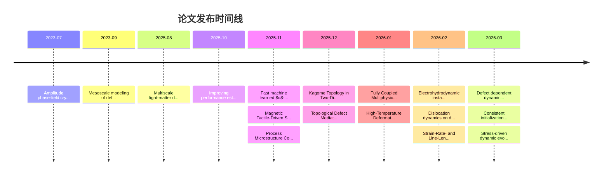

# 论文知识体系图谱

> 自动生成 | 总论文数: 57 | 更新时间: 2026-04-15 05:06 UTC

## 知识体系思维导图

## 论文发布时间线（近12个月）

## 主题-侧重点交叉分析

| 主题方向 | 论文数 | 主要侧重点 | 代表论文 |
|----------|--------|------------|----------|
| Multiphysics Coupling | 17 | 多物理耦合与跨场耦合机制, 分子动力学与原子尺度机制, 拉伸响应与本构行为 | Fully Coupled Multiphysics Model... |
| Molecular Dynamics | 41 | 分子动力学与原子尺度机制, 多物理耦合与跨场耦合机制, 拉伸响应与本构行为 | Electrohydrodynamic instability... |
| Phase-Field Crystal | 3 | 相场晶体与组织演化, 拉伸响应与本构行为, 多物理耦合与跨场耦合机制 | Dislocation dynamics on deformab... |
| Metal Fatigue Simulation | 3 | 疲劳损伤与断裂演化, 拉伸响应与本构行为, 多物理耦合与跨场耦合机制 | Fully Coupled Multiphysics Model... |
| Tensile / Deformation Simulation | 15 | 拉伸响应与本构行为, 分子动力学与原子尺度机制, 疲劳损伤与断裂演化 | Fully Coupled Multiphysics Model... |
