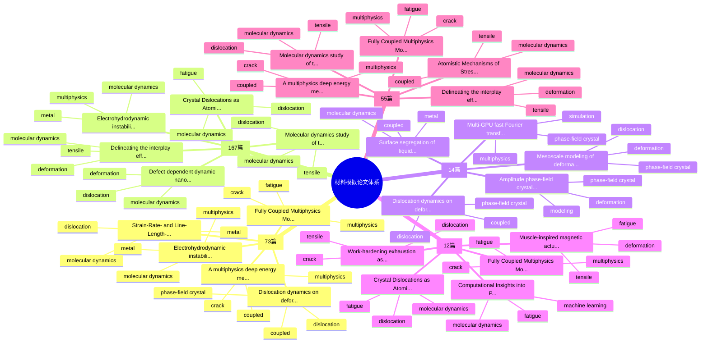
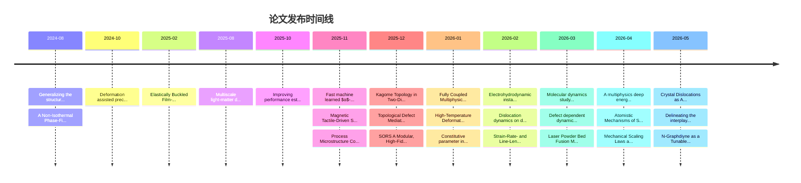

# 论文知识体系图谱

> 自动生成 | 总论文数: 257 | 更新时间: 2026-06-01 05:53 UTC

## 知识体系思维导图

```mermaid
mindmap
  root((材料模拟论文体系))
    Multiphysics Coupling [73篇]
      Fully Coupled Multiphysics Mo...
        fatigue
        multiphysics
        crack
      A multiphysics deep energy me...
        multiphysics
        crack
        coupled
      Electrohydrodynamic instabili...
        molecular dynamics
        multiphysics
        metal
      Dislocation dynamics on defor...
        phase-field crystal
        dislocation
        coupled
      Strain-Rate- and Line-Length-...
        molecular dynamics
        dislocation
        metal
    Molecular Dynamics [167篇]
      Crystal Dislocations as Atomi...
        molecular dynamics
        fatigue
        dislocation
      Molecular dynamics study of t...
        molecular dynamics
        dislocation
        tensile
      Electrohydrodynamic instabili...
        molecular dynamics
        multiphysics
        metal
      Defect dependent dynamic nano...
        molecular dynamics
        dislocation
        deformation
      Delineating the interplay eff...
        molecular dynamics
        tensile
        deformation
    Phase-Field Crystal [14篇]
      Dislocation dynamics on defor...
        phase-field crystal
        dislocation
        coupled
      Surface segregation of liquid...
        molecular dynamics
        metal
        coupled
      Multi-GPU fast Fourier transf...
        phase-field crystal
        multiphysics
        simulation
      Amplitude phase-field crystal...
        phase-field crystal
        deformation
        modeling
      Mesoscale modeling of deforma...
        phase-field crystal
        dislocation
        deformation
    Metal Fatigue Simulation [12篇]
      Fully Coupled Multiphysics Mo...
        fatigue
        multiphysics
        crack
      Crystal Dislocations as Atomi...
        molecular dynamics
        fatigue
        dislocation
      Computational Insights into P...
        molecular dynamics
        fatigue
        machine learning
      Work-hardening exhaustion as...
        crack
        dislocation
        tensile
      Muscle-inspired magnetic actu...
        fatigue
        tensile
        deformation
    Tensile / Deformation Simulation [55篇]
      Fully Coupled Multiphysics Mo...
        fatigue
        multiphysics
        crack
      Molecular dynamics study of t...
        molecular dynamics
        dislocation
        tensile
      A multiphysics deep energy me...
        multiphysics
        crack
        coupled
      Delineating the interplay eff...
        molecular dynamics
        tensile
        deformation
      Atomistic Mechanisms of Stres...
        molecular dynamics
        tensile
        coupled
```

## 论文发布时间线（近12个月）

```mermaid
timeline
    title 论文发布时间线
    2024-08 : Generalizing the structur... : A Non-Isothermal Phase-Fi...
    2024-10 : Deformation assisted prec...
    2025-02 : Elastically Buckled Film-...
    2025-08 : Multiscale light-matter d...
    2025-10 : Improving performance est...
    2025-11 : Fast machine learned $α$-... : Magnetic Tactile-Driven S... : Process Microstructure Co...
    2025-12 : Kagome Topology in Two-Di... : Topological Defect Mediat... : SORS A Modular, High-Fid...
    2026-01 : Fully Coupled Multiphysic... : High-Temperature Deformat... : Constitutive parameter in...
    2026-02 : Electrohydrodynamic insta... : Dislocation dynamics on d... : Strain-Rate- and Line-Len...
    2026-03 : Molecular dynamics study... : Defect dependent dynamic... : Laser Powder Bed Fusion M...
    2026-04 : A multiphysics deep energ... : Atomistic Mechanisms of S... : Mechanical Scaling Laws a...
    2026-05 : Crystal Dislocations as A... : Delineating the interplay... : N-Graphdiyne as a Tunable...
```

## 主题-侧重点交叉分析

| 主题方向 | 论文数 | 主要侧重点 | 代表论文 |
|----------|--------|------------|----------|
| Multiphysics Coupling | 73 | 多物理耦合与跨场耦合机制, 分子动力学与原子尺度机制, 数据驱动与机器学习建模 | Fully Coupled Multiphysics Model... |
| Molecular Dynamics | 167 | 分子动力学与原子尺度机制, 多物理耦合与跨场耦合机制, 数据驱动与机器学习建模 | Electrohydrodynamic instability... |
| Phase-Field Crystal | 14 | 相场晶体与组织演化, 多物理耦合与跨场耦合机制, 拉伸响应与本构行为 | Dislocation dynamics on deformab... |
| Metal Fatigue Simulation | 12 | 疲劳损伤与断裂演化, 拉伸响应与本构行为, 多物理耦合与跨场耦合机制 | Fully Coupled Multiphysics Model... |
| Tensile / Deformation Simulation | 55 | 拉伸响应与本构行为, 分子动力学与原子尺度机制, 多物理耦合与跨场耦合机制 | Fully Coupled Multiphysics Model... |
